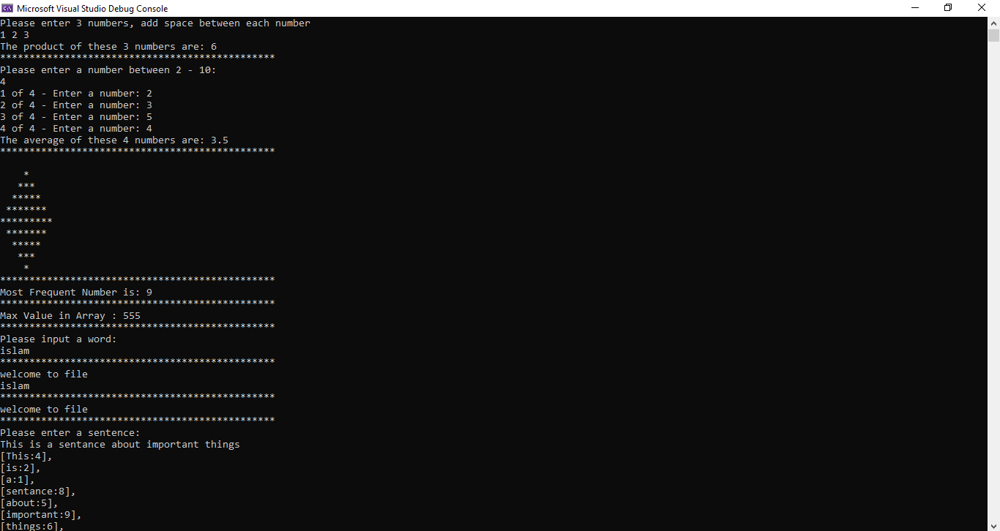
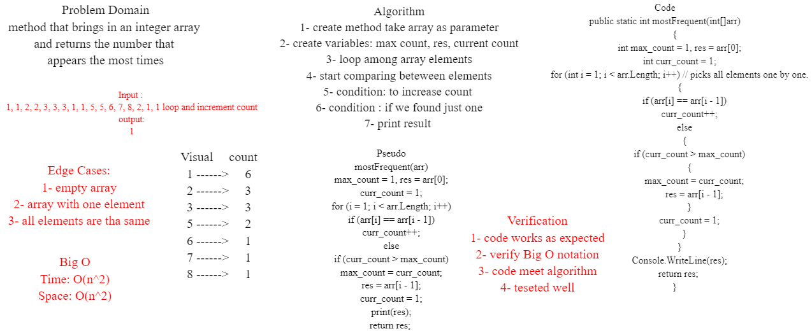

# Lab3-System.IO

### Program contains 9 methods some of them related to system.io library, and others is c# practice.

### After you clone the project you can open it in vs IDE and run the program.

### Program contains Unit Test, test the functionality for the methods

### Result

### Whiteboard Proces for challenge 4

